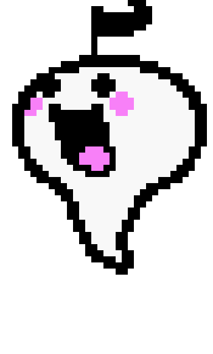

    <h1>Hello! I'm Borists</h1>
    I'm a person who is interested in video games and coding. 
    although I don't really have any code on any of my github repositories (unless you count my website)

<h2>My projects</h2>

<h3><a href="https://github.com/Borists1/RhythmHeavenFeverHD/">Rhythm Heaven Fever HD</a></h3>

This is a project i'm making where I upscale the Wii game Rhythm Heaven Fever's textures for use with the Dolphin Emulator.

<h2>Socials</h2>

    
    
     
    

<!--
**Borists1/Borists1** is a ✨ _special_ ✨ repository because its `README.md` (this file) appears on your GitHub profile.

Here are some ideas to get you started:

- 🔭 I’m currently working on ...
- 🌱 I’m currently learning ...
- 👯 I’m looking to collaborate on ...
- 🤔 I’m looking for help with ...
- 💬 Ask me about ...
- 📫 How to reach me: ...
- 😄 Pronouns: ...
- ⚡ Fun fact: ...

-->
